# Freshtees Customer Gateway – Flow

View this file in an editor or tool that supports Mermaid (e.g. GitHub, VS Code with Mermaid extension, or [mermaid.live](https://mermaid.live)).

```mermaid
flowchart TB
  subgraph wizard["Wizard (6 steps)"]
    Q1["Q1: Purpose\n(Brand/Resale, Tour/Music, Sports, Corporate, Event/Promo, Agency, Other)"]
    Q2["Q2: Quantity\n(1-24, 25-49, 50-99, 100-249, 250+, Unsure)"]
    Q3["Q3: Garments\n(Tees, Sweats, Hats, Corporate, Totes, Other, Unsure)"]
    Q4["Q4: Artwork\n(Yes, Partially, No)"]
    Q5["Q5: Placements & specs\n(Yes, Partially, No)"]
    Q6["Q6: Budget\n(Yes, No, Exploring)"]
    Q1 --> Q2 --> Q3 --> Q4 --> Q5 --> Q6
  end

  Q2 --> small_early{"Quantity 1-24 or 25-49?"}
  small_early -->|Yes| Small["Small Order Outcome\nGate message + CTA to design tool"]

  Q6 --> end_check{"Bulk order?\n(50+ / 100+ / 250+ / Unsure)"}
  end_check -->|No| Small
  end_check -->|Yes| qualified_check{"Bulk qualified?\n(artwork=yes, placements=yes|partially, budget=yes)"}
  qualified_check -->|No| Education["Education Outcome\nTopic blocks (artwork, placements, budget)\n+ Quote form"]
  qualified_check -->|Yes| Qualified["Qualified Outcome"]

  subgraph qualified_flow["Qualified path"]
    Qualified --> Anchor["Pricing anchor block\n(Indicative from $X per unit*)"]
    Anchor --> Config["Project Configurator\n• Purpose (read-only from wizard, editable)\n• Add products (type, model, colour, qty)\n• Placements: Front/Back/Sleeves\n  Print: Screen / Embroidery / DTF / Unsure\n  (Colour count 1–10 for Screen only)\n• Finishes: Fold & Bag, Neck Print, Woven, Pip, Swing Tag, Barcodes\n• Due date"]
    Config --> CalcBtn["User: 'Calculate indicative pricing'"]
    CalcBtn --> ContactGate["Contact form\n(Full name *, Email *, Phone *,\n Business name optional)"]
    ContactGate --> Validate{"Required fields\nfilled?"}
    Validate -->|No| ContactGate
    Validate -->|Yes| Pricing["Dynamic pricing shown\n• Product breakdown (garment, print, setup, finish)\n• Estimated product total\n• Effective unit cost\n• Project total (if multiple products)"]
    Pricing --> Timeline["Production timeline\nRush options"]
    Timeline --> CTA["Calendly link\n+ Quote form"]
    CTA --> QuoteAPI["Quote API payload:\nproject_purpose, artwork_status,\ncontact_details, project_products,\nindicative_pricing_shown, timestamp"]
  end
```

## Decision rules (from config)

| Rule | Source |
|------|--------|
| **Small order** | Quantity = 1-24 or 25-49 → exit after Q2, or at end if not “bulk” |
| **Bulk** | Quantity = 50-99, 100-249, 250+, or Unsure |
| **Bulk qualified** | `bulkQualifiedRules`: artwork ∈ [yes], placements ∈ [yes, partially], budget ∈ [yes] |
| **Education** | Bulk but not qualified → education topics + quote form |
| **Qualified** | Bulk and qualified → configurator + contact gate + pricing + quote |

## Data carried to quote (qualified path)

- **From wizard:** `purpose`, `artwork` (→ `artwork_status` in payload)
- **From configurator:** `purpose`, `artworkStatus`, `products`, `contactDetails`, `contactSubmittedAt`, `summary`
- **API payload:** `project_purpose`, `artwork_status`, `contact_details`, `project_products`, `indicative_pricing_shown`, `timestamp` (+ name, email, phone, message, context, answers, submittedAt)
